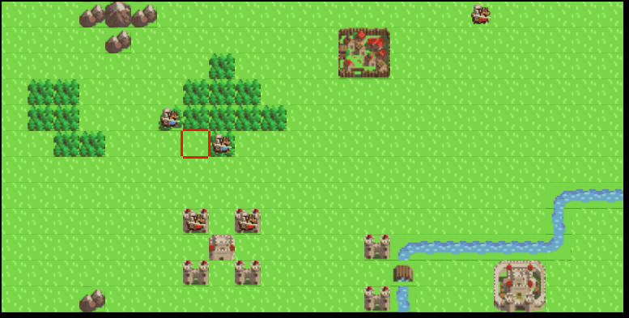

# MedievalWar [](https://github.com/tranchikhang/MedievalWar)
\

Medieval War is a turn-based strategy game I worked in my free time, inspired by the Fire Emblem series. This game is built in JavaScript using the Phaser 3 Framework.